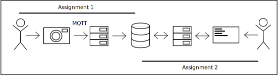

# MQTT-image-management
Transfer images taken with a camera to a backend server using the MQTT protocol and display them on the frontend

## Basic Components

1. image capturing device: sends images to server via MQTT (publish)
2. ImageDatabseServer: receives images and stores them in database
3. database: stores images
4. image management server: backend for managing stored images
5. management UI: frontend for managing and displaying stored images
6. 

## Workflows
1. user takes photo and saves image to database using mqtt client
2. user views, gets, modifies and deltes the images in the database using a web frontend